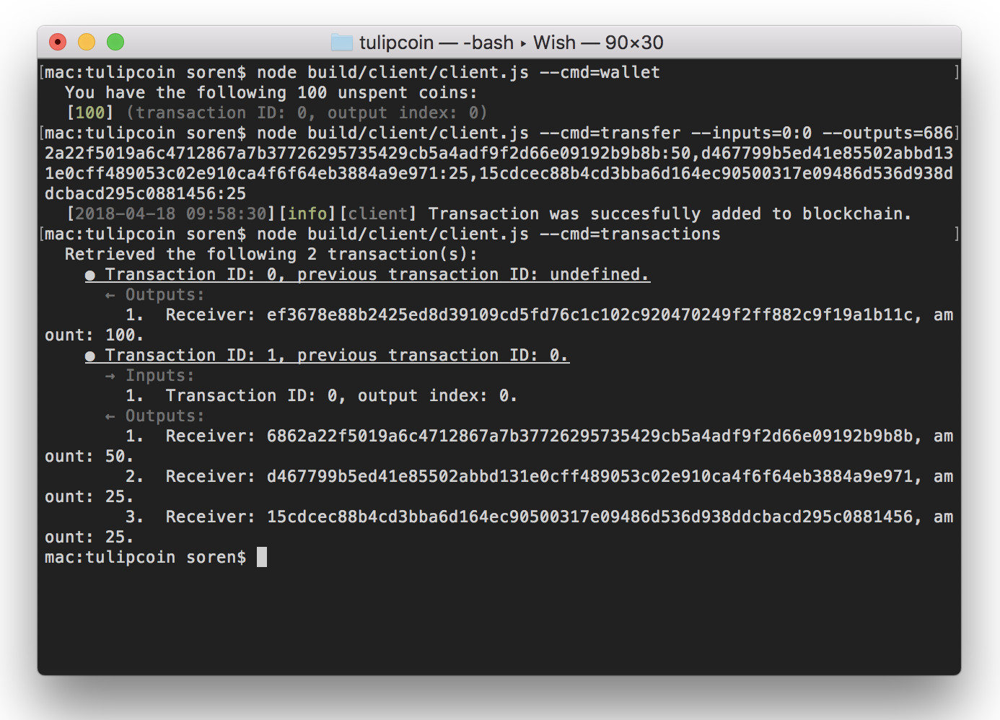

# Tulipcoin

Tulipcoin is the hot new cryptocurrency without all the fat of other popular cryptocurrencies: security, performance, scalability and decentralisation.

## Features

### Security

Who really cares about security? Our precious development man-hours were spent on over-optimizing modules with absolutely no gain in performance, guaranteed.

### Performance

Blazingly fast, and blazingly useless.

### Scalability

One network - one host. Packing the entire network into a single machine makes flipping the light off at night an adventurous gamble.

### Centralized control

With a centralized model of control it is much easier to enforce your will on other peoples crypto-wallets. Enjoy the freedom of fully controlling *your* coin, and being able to ignore the opinions of others.

## Usage

### Configuration

By default, Tulipcoin will search for a `tulipconfig.json` file in your working directory. A configuration file contains values for some central parameters:

```json
{
    "keySize": 512, // system-wide size of wallet RSA keys in bits
    "host": "localhost:8080", // the server host
    "port": 8080, // the local port to start the server on
    "wallet": "wallet.json" // relative path to the default wallet file used by the client and server
}
```

You can freely omit any of the parameters.

If no `tulipconfig.json` file is found, the client and server will require these parameters manually (see sections below).

### Wallets

Wallets serve as general placeholders for public/private RSA key pairs, they are JSON files with `public` and `private` properties that contain PEM formatted RSA keys.

To generate a new wallet, use the wallet module:

```console
$ node build/wallet.js --b 512 --o wallet.json
``` 

The `--b` parameter specifies the keysize in bits. If the parameter is omitted the value will be extracted from the tulip config file (if one exists), otherwise the default is 512 bits. The optional `--o` parameter specifies the path to where the keys should be saved.

### Server

The server module launches and manages a fully-fledged tulipcoin server.

<p align="center">
    
</p>

#### Setup

By entering a single command, you can reign over your closest friends who entrust you with their precious tulipcoins:

```console
$ node build/server/server.js
  [2018-04-18 09:45:02][info][blockchain] Appending transaction with id: 0 to blockchain.
  [2018-04-18 09:45:02][info][utxo] Added UTXO to pool with transaction id: 0 and output index: 0.
  [2018-04-18 09:45:02][info][server] Starting server with 100 coins.
  [2018-04-18 09:45:02][info][restserver] Server started on port 8080.
```

By default the server will start on port 8080 and create 100 coins out of thin air right into your pocket. To override the port number use `--p <number>`. Similarly, to change the amount of coins created you use `--amount <number>`. The amount of coins created are fixed, so choose wisely. There is no mining, since that would defeat the purpose of a vastly superior centralized system.

#### Managing (REST API)

The Tulipcoin server will take of handling incoming transactions and other requests. All server communication is done through a REST API. You may view the transactions in the blockchain by browsing to http://<yourserveraddress>/transactions: 

<p align="center">
    
</p>

### Client

The client is a command-line module that handles checking your wallet, getting the list of transactions from the network and creating a new transaction. Internally we refer to the clients as "filthy peasants".

<p align="center">
    
</p>

#### Global parameters

Whenever the client module is called you are free to configure it with some additional global parameters (they will be required if no `tulipconfig.json` file is found).

- ``--host``: Set the host of the server
- ``--wallet``: Set the path to the wallet file used

Setting these parameters will override any previous parameters retrieved from a config file.

#### Checking your wallet
 
```console
$ node build/client/client.js --cmd=wallet
  You have the following 100 unspent coins:
  [100] (transaction ID: 0, output index: 0)
```

#### Retrieving a list of transactions

To get all transactions in the blockchain, use:

```console
$ node build/client/client.js --cmd=transactions
  Retrieved the following 2 transaction(s):
    ● Transaction ID: 0, previous transaction ID: undefined.
      ← Outputs:
        1.  Receiver: 15cdcec88b4cd3bba6d164ec90500317e09486d536d938ddcbacd295c0881456, amount: 100.
    ● Transaction ID: 1, previous transaction ID: 0.
      → Inputs:
        1.  Transaction ID: 0, output index: 0.
      ← Outputs:
        1.  Receiver: 6862a22f5019a6c4712867a7b37726295735429cb5a4adf9f2d66e09192b9b8b, amount: 50.
        2.  Receiver: d467799b5ed41e85502abbd131e0cff489053c02e910ca4f6f64eb3884a9e971, amount: 25.
        3.  Receiver: 15cdcec88b4cd3bba6d164ec90500317e09486d536d938ddcbacd295c0881456, amount: 25.
```

To get a single transaction, append the `--id` parameter:

```console
$ node build/client/client.js --cmd=transactions --id=1
    ● Transaction ID: 1, previous transaction ID: 0.
      → Inputs:
        1.  Transaction ID: 0, output index: 0.
      ← Outputs:
        1.  Receiver: 6862a22f5019a6c4712867a7b37726295735429cb5a4adf9f2d66e09192b9b8b, amount: 50.
        2.  Receiver: d467799b5ed41e85502abbd131e0cff489053c02e910ca4f6f64eb3884a9e971, amount: 25.
        3.  Receiver: 15cdcec88b4cd3bba6d164ec90500317e09486d536d938ddcbacd295c0881456, amount: 25.
```

#### Creating a new transaction

Transactions are created by specifying a number of inputs (which previous transactions your coins are coming from) and a number of outputs (where your coins are going to):

```console
$ node build/client/client.js --cmd=transfer --inputs=0:0 --outputs=6862a22f5019a6c4712867a7b37726295735429cb5a4adf9f2d66e09192b9b8b:50,d467799b5ed41e85502abbd131e0cff489053c02e910ca4f6f64eb3884a9e971:25,15cdcec88b4cd3bba6d164ec90500317e09486d536d938ddcbacd295c0881456:25
  [2018-04-18 09:26:52][info][client] Transaction was succesfully added to blockchain.
```

The `--inputs` parameter is formatted as txId1:outputIndex, txId2:outputIndex, ... 
The `--outputs` parameter is formatted as publicKey1:amount, publicKey2: amount, ...

## Installation & build

To install all dependencies:

```console
$ npm install
```

Then build the source code (uses TypeScript to compile):

```console
$ npm run build
```

It's also possible to setup a TypeScript watcher that compiles automatically on changes to source files:

```console
$ npm run watch
```

## Requirements

Node.JS is required.

## License

Code copyright 2018 Søren Qvist Christensen. Code released under [the MIT license](LICENSE).